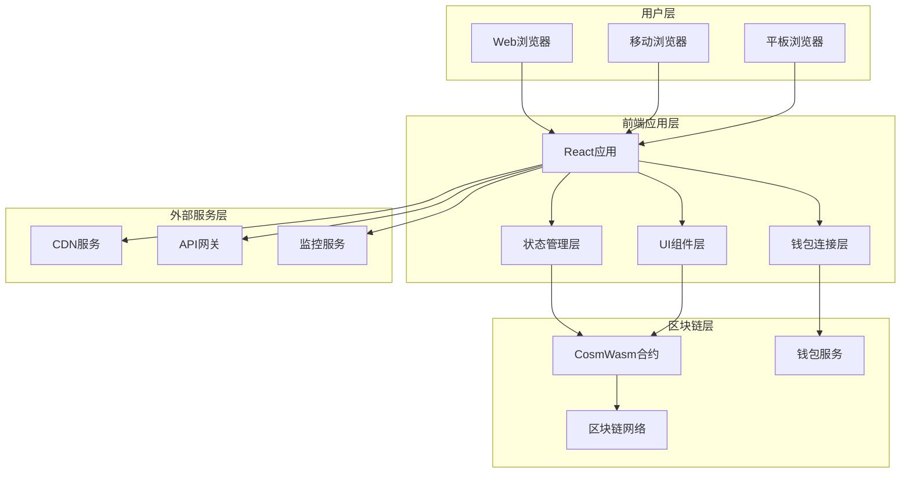
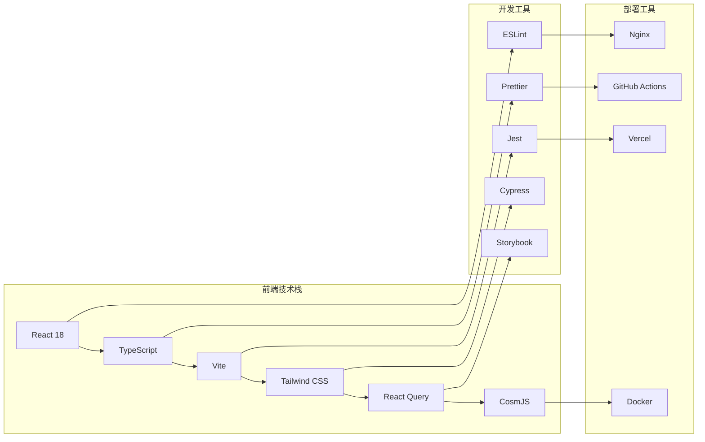
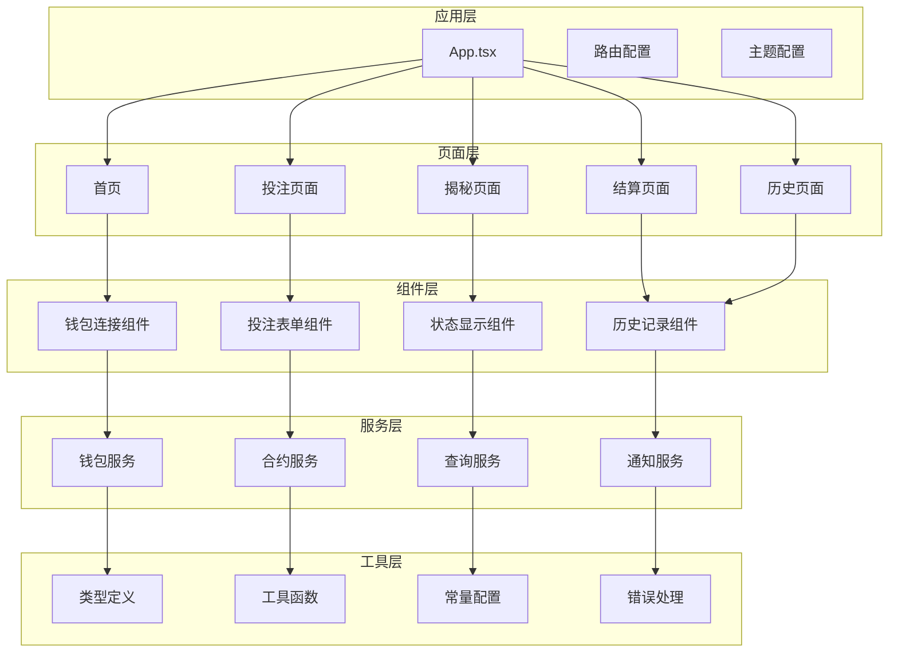
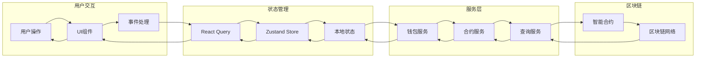

# DD 3D 彩票前端 概要设计文档

## 📋 文档信息

- **项目名称**: DD 3D Lottery Frontend (3D彩票前端应用)
- **版本**: v1.0.0
- **文档类型**: 前端概要设计文档
- **创建日期**: 2024-01-XX
- **最后更新**: 2024-01-XX

## 🎯 概述

本文档定义了DD 3D Lottery前端应用的整体架构设计，包括技术选型、系统架构、模块划分、数据流设计等核心设计决策。

## 🏗️ 系统架构

### 1.1 整体架构图



### 1.2 技术架构



## 🛠️ 技术选型

### 2.1 核心框架

```yaml
core_frameworks:
  react:
    version: "18.2.0"
    description: "用户界面框架"
    reasons:
      - "组件化开发"
      - "虚拟DOM性能"
      - "丰富的生态系统"
      - "TypeScript支持"
    
  typescript:
    version: "5.0.0"
    description: "类型安全的JavaScript"
    reasons:
      - "类型检查"
      - "代码提示"
      - "重构安全"
      - "团队协作"
    
  vite:
    version: "4.4.0"
    description: "快速构建工具"
    reasons:
      - "快速热更新"
      - "ES模块支持"
      - "插件生态"
      - "构建优化"
```

### 2.2 样式框架

```yaml
styling_frameworks:
  tailwind_css:
    version: "3.3.0"
    description: "原子化CSS框架"
    reasons:
      - "快速开发"
      - "一致性设计"
      - "响应式支持"
      - "自定义主题"
    
  headless_ui:
    version: "1.7.0"
    description: "无样式UI组件"
    reasons:
      - "可访问性"
      - "键盘导航"
      - "自定义样式"
      - "React集成"
```

### 2.3 状态管理

```yaml
state_management:
  react_query:
    version: "4.32.0"
    description: "服务端状态管理"
    reasons:
      - "缓存机制"
      - "后台更新"
      - "错误处理"
      - "加载状态"
    
  zustand:
    version: "4.4.0"
    description: "客户端状态管理"
    reasons:
      - "轻量级"
      - "TypeScript支持"
      - "简单API"
      - "性能优化"
```

### 2.4 区块链集成

```yaml
blockchain_integration:
  cosmjs:
    version: "0.32.0"
    description: "Cosmos SDK JavaScript库"
    reasons:
      - "官方支持"
      - "CosmWasm支持"
      - "钱包集成"
      - "交易构建"
    
  keplr_wallet:
    version: "0.10.0"
    description: "Keplr钱包集成"
    reasons:
      - "用户友好"
      - "安全可靠"
      - "多链支持"
      - "社区活跃"
```

## 📦 模块设计

### 3.1 模块划分



### 3.2 核心模块

#### 3.2.1 钱包连接模块

```typescript
// 钱包连接模块设计
interface WalletService {
  // 连接钱包
  connect(): Promise<WalletInfo>;
  
  // 断开连接
  disconnect(): Promise<void>;
  
  // 获取账户信息
  getAccount(): Promise<AccountInfo>;
  
  // 获取余额
  getBalance(denom: string): Promise<Balance>;
  
  // 发送交易
  sendTransaction(tx: Transaction): Promise<TransactionResult>;
  
  // 监听事件
  on(event: string, callback: Function): void;
}

// 支持的钱包类型
enum WalletType {
  KEPLR = 'keplr',
  COSMOSTATION = 'cosmostation',
  LEAP = 'leap'
}
```

#### 3.2.2 合约交互模块

```typescript
// 合约交互模块设计
interface ContractService {
  // 查询当前会话
  getCurrentSession(): Promise<LotterySession>;
  
  // 查询参与者信息
  getParticipantInfo(address: string): Promise<ParticipantInfo>;
  
  // 查询彩票结果
  getLotteryResult(sessionId: string): Promise<LotteryResult>;
  
  // 投注操作
  placeBet(commitmentHash: string): Promise<TransactionResult>;
  
  // 揭秘操作
  revealRandom(luckyNumbers: number[], randomSeed: string): Promise<TransactionResult>;
  
  // 结算操作
  settleLottery(): Promise<TransactionResult>;
}
```

#### 3.2.3 状态管理模块

```typescript
// 状态管理模块设计
interface AppState {
  // 钱包状态
  wallet: {
    connected: boolean;
    address: string;
    balance: Balance;
    type: WalletType;
  };
  
  // 彩票状态
  lottery: {
    currentSession: LotterySession;
    phase: LotteryPhase;
    participantInfo: ParticipantInfo;
    history: LotteryResult[];
  };
  
  // UI状态
  ui: {
    loading: boolean;
    error: string | null;
    theme: 'light' | 'dark';
    language: 'zh' | 'en';
  };
}
```

## 🔄 数据流设计

### 4.1 数据流架构



### 4.2 状态同步机制

```typescript
// 状态同步机制设计
class StateSyncManager {
  // 轮询更新
  startPolling(interval: number): void;
  
  // 停止轮询
  stopPolling(): void;
  
  // 手动刷新
  refresh(): Promise<void>;
  
  // 监听区块链事件
  listenToBlockchainEvents(): void;
  
  // 处理状态更新
  handleStateUpdate(update: StateUpdate): void;
}
```

## 🎨 UI/UX设计

### 5.1 设计系统

```yaml
design_system:
  colors:
    primary: "#3B82F6"
    secondary: "#10B981"
    success: "#059669"
    warning: "#F59E0B"
    error: "#DC2626"
    background: "#FFFFFF"
    surface: "#F9FAFB"
    text: "#111827"
    
  typography:
    font_family: "Inter, system-ui, sans-serif"
    font_sizes:
      xs: "0.75rem"
      sm: "0.875rem"
      base: "1rem"
      lg: "1.125rem"
      xl: "1.25rem"
      "2xl": "1.5rem"
      "3xl": "1.875rem"
      
  spacing:
    xs: "0.25rem"
    sm: "0.5rem"
    md: "1rem"
    lg: "1.5rem"
    xl: "2rem"
    "2xl": "3rem"
    
  breakpoints:
    sm: "640px"
    md: "768px"
    lg: "1024px"
    xl: "1280px"
    "2xl": "1536px"
```

### 5.2 组件设计

```typescript
// 组件设计规范
interface ComponentProps {
  // 基础属性
  className?: string;
  children?: React.ReactNode;
  
  // 状态属性
  loading?: boolean;
  disabled?: boolean;
  error?: string;
  
  // 事件处理
  onClick?: () => void;
  onSubmit?: (data: any) => void;
  onChange?: (value: any) => void;
}

// 组件变体
type ComponentVariant = 'primary' | 'secondary' | 'success' | 'warning' | 'error';
type ComponentSize = 'sm' | 'md' | 'lg';
```

## 🔒 安全设计

### 6.1 前端安全

```yaml
security_measures:
  input_validation:
    - "客户端输入验证"
    - "XSS防护"
    - "CSRF防护"
    - "SQL注入防护"
    
  data_protection:
    - "敏感数据加密"
    - "本地存储安全"
    - "传输加密"
    - "访问控制"
    
  wallet_security:
    - "钱包连接验证"
    - "交易签名验证"
    - "私钥保护"
    - "钓鱼防护"
```

### 6.2 错误处理

```typescript
// 错误处理设计
interface ErrorHandler {
  // 错误类型
  type: 'network' | 'wallet' | 'contract' | 'validation';
  
  // 错误信息
  message: string;
  
  // 错误代码
  code: string;
  
  // 处理方式
  action: 'retry' | 'redirect' | 'show' | 'ignore';
}

// 错误处理策略
class ErrorHandlingStrategy {
  // 网络错误
  handleNetworkError(error: NetworkError): void;
  
  // 钱包错误
  handleWalletError(error: WalletError): void;
  
  // 合约错误
  handleContractError(error: ContractError): void;
  
  // 验证错误
  handleValidationError(error: ValidationError): void;
}
```

## 📱 响应式设计

### 7.1 断点设计

```yaml
responsive_breakpoints:
  mobile:
    min_width: "320px"
    max_width: "767px"
    features:
      - "单列布局"
      - "触摸优化"
      - "简化导航"
      - "大按钮设计"
      
  tablet:
    min_width: "768px"
    max_width: "1023px"
    features:
      - "双列布局"
      - "触摸和鼠标支持"
      - "中等按钮"
      - "侧边栏导航"
      
  desktop:
    min_width: "1024px"
    max_width: "1439px"
    features:
      - "多列布局"
      - "鼠标优化"
      - "标准按钮"
      - "完整导航"
      
  large_desktop:
    min_width: "1440px"
    features:
      - "宽屏布局"
      - "多窗口支持"
      - "高级功能"
      - "完整界面"
```

### 7.2 适配策略

```typescript
// 响应式适配策略
interface ResponsiveConfig {
  // 断点配置
  breakpoints: {
    sm: number;
    md: number;
    lg: number;
    xl: number;
  };
  
  // 布局配置
  layout: {
    columns: number;
    spacing: number;
    padding: number;
  };
  
  // 组件配置
  components: {
    buttonSize: 'sm' | 'md' | 'lg';
    inputSize: 'sm' | 'md' | 'lg';
    cardSize: 'sm' | 'md' | 'lg';
  };
}
```

## 🚀 性能优化

### 8.1 加载优化

```yaml
loading_optimization:
  code_splitting:
    - "路由级别分割"
    - "组件级别分割"
    - "动态导入"
    - "懒加载"
    
  resource_optimization:
    - "图片压缩"
    - "字体优化"
    - "CSS压缩"
    - "JS压缩"
    
  caching_strategy:
    - "浏览器缓存"
    - "CDN缓存"
    - "Service Worker"
    - "内存缓存"
```

### 8.2 运行时优化

```yaml
runtime_optimization:
  rendering_optimization:
    - "虚拟滚动"
    - "列表优化"
    - "组件缓存"
    - "重渲染优化"
    
  state_optimization:
    - "状态分割"
    - "选择器优化"
    - "批量更新"
    - "防抖节流"
    
  network_optimization:
    - "请求合并"
    - "数据预取"
    - "离线支持"
    - "重试机制"
```

## 📊 监控和日志

### 9.1 监控设计

```typescript
// 监控系统设计
interface MonitoringService {
  // 性能监控
  trackPerformance(metric: PerformanceMetric): void;
  
  // 错误监控
  trackError(error: Error): void;
  
  // 用户行为监控
  trackUserAction(action: UserAction): void;
  
  // 业务指标监控
  trackBusinessMetric(metric: BusinessMetric): void;
}

// 监控指标
interface PerformanceMetric {
  name: string;
  value: number;
  timestamp: number;
  tags: Record<string, string>;
}
```

### 9.2 日志设计

```typescript
// 日志系统设计
interface LoggingService {
  // 日志级别
  level: 'debug' | 'info' | 'warn' | 'error';
  
  // 日志记录
  log(level: LogLevel, message: string, data?: any): void;
  
  // 日志过滤
  filter(filter: LogFilter): void;
  
  // 日志导出
  export(format: 'json' | 'csv'): string;
}
```

## 📝 变更记录

| 版本 | 日期 | 变更内容 | 变更人 |
|------|------|----------|--------|
| v1.0 | 2024-01-XX | 初始概要设计文档创建 | AI Assistant |

---

**注意**: 本文档定义了DD 3D彩票前端应用的整体架构设计，所有开发工作都必须基于此文档进行。
